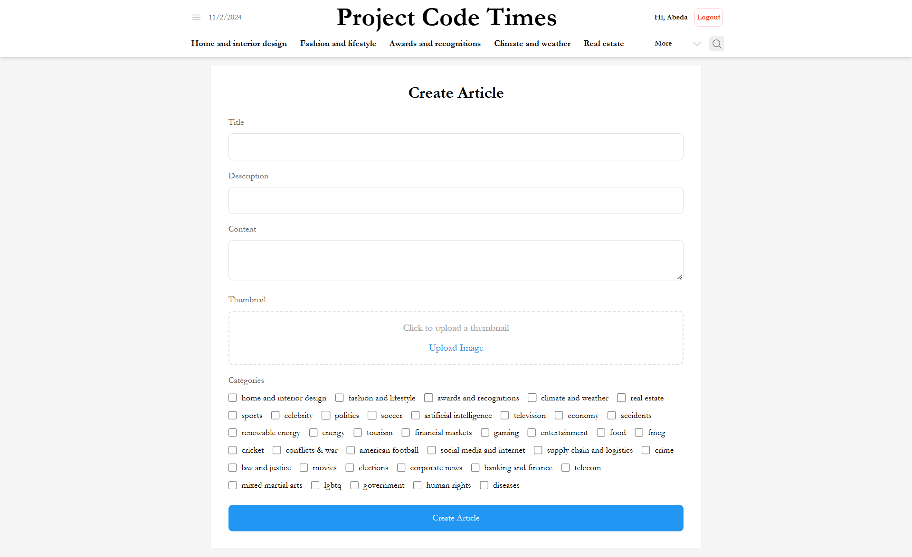
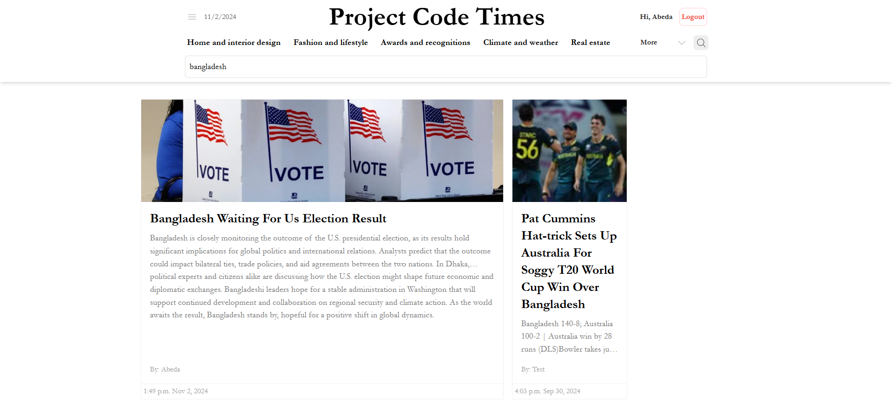

# Newspaper-Solo-Project-

## Project

### Features

    Real-time Data Fetching with Caching: Reduces server load and improves performance by storing data in a cache for reuse.
    Optimized UI: Provides a seamless reading experience with efficient state and component management.
    Testing Suite: Ensures application reliability with unit tests for functions and E2E testing for critical workflows.

### Setup and Installation

    git clone https://github.com/abedakhanam/Newspaper-Solo-Project-.git

    npm install

    Run the application in development mode.

    npm run dev

### Project Structure

    src/utils/cache.ts: Implements caching logic.
    src/utils/sharedFunctions.ts: Contains utility functions like word capitalization and date formatting.
    src/tests: Includes test cases for cache functionality, utility functions, and components.

### Caching

The caching mechanism stores fetched data locally for an hour to reduce unnecessary API requests. Key functionalities:

    setCache: Stores data in cache with a timestamp.
    getCache: Retrieves data if valid; otherwise, deletes the expired cache entry.
    clearCache: Clears all cache entries.

    let cache: CacheObj = {};

    function setCache(key: string, value: any) {
        cache[key] = { data: value, timestamp: Date.now() };
    }

    function getCache(key: string) {
        const cachedItem = cache[key];
        if (!cachedItem || Date.now() - cachedItem.timestamp > validity) {
            delete cache[key];
            return null;
        }
        return cachedItem.data;
    }

### Testing

#### Unit Testing with Jest

The project includes unit tests to verify the functionality of caching and utility functions:

    Cache Tests: Ensure correct caching behavior and expiration handling.
    Utility Tests: Test capitalizeWords for different input cases.

Example of a cache test:

    test("should set and get cached data correctly", () => {
        const key = "testKey";
        const value = { foo: "bar" };
        setCache(key, value);
        expect(getCache(key)).toEqual(value);
    });

#### End-to-End Testing with Selenium

Selenium WebDriver is used for E2E testing to validate user workflows, ensuring that the application works as expected in a live environment.

### Scripts

    npm run dev: Starts the development server.
    npm run build: Builds the project.
    npm run lint: Runs ESLint.
    npm run test: Executes Jest tests.

### Technologies Used

    Frontend: React, Tailwind CSS, Material Tailwind
    Caching: Custom caching solution implemented in TypeScript.
    Testing: Jest (unit testing), Selenium WebDriver (E2E testing)
    Utilities: react-toastify, react-router-dom for routing and notifications

## Screenshots of website

### Home page

### Create Article Page

### Search Article Page

